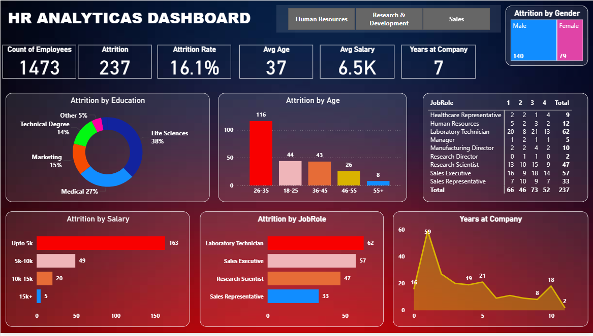

# HR Attrition Analytics Dashboard (Power BI)

This project is an end-to-end **HR Analytics Dashboard** built in **Power BI** to analyze employee attrition and help HR teams take data-driven decisions.  

The dashboard tracks key metrics such as **employee count, attrition, attrition rate, average age, average salary, and average years at company**, and provides deep-dive views by **gender, age, education, salary band, job role, and tenure**.

---

## 1. Business Problem

The HR team is facing a high number of employees leaving the organization and wants to understand:

- Which **age groups**, **job roles**, and **salary bands** have the highest attrition?
- Are there differences in attrition by **gender** or **education background**?
- How does **tenure (years at company)** impact attrition?
- What insights can support targeted **retention strategies**?

The goal of this dashboard is to provide a single view of HR data to quickly identify at-risk segments and support strategic decision-making.

---

## 2. Data Overview

- **Source**: HR employee dataset (simulated / anonymized).
- **Rows (Employees)**: 1,473  
- **Key columns** (examples):
  - `EmployeeID`
  - `Age`
  - `Gender`
  - `EducationField`
  - `JobRole`
  - `MonthlyIncome` / `SalaryBand`
  - `YearsAtCompany`
  - `Attrition` (Yes/No)

More details are available in [`docs/data_dictionary.md`](docs/data_dictionary.md).

---

## 3. Dashboard Features

### 3.1 Top KPIs

- **Count of Employees:** 1,473  
- **Attrition Count:** 237  
- **Attrition Rate:** 16.1%  
- **Average Age:** 37 years  
- **Average Salary:** 6.5K (monthly)  
- **Average Years at Company:** 7 years  

### 3.2 Visuals & Analysis

- **Attrition by Gender**
  - Bar chart showing male vs female attrition counts.

- **Attrition by Education**
  - Donut chart for Life Sciences, Medical, Marketing, Technical Degree, Other.

- **Attrition by Age**
  - Bar chart by age groups: 18–25, 26–35, 36–45, 46–55, 55+  
  - Shows highest attrition in the **26–35** group.

- **Attrition by Salary Band**
  - Horizontal bar chart by salary ranges: `Upto 5k`, `5k–10k`, `10k–15k`, `15k+`.

- **Attrition by Job Role**
  - Horizontal bar chart for roles such as:
    - Laboratory Technician
    - Sales Executive
    - Research Scientist
    - Sales Representative
  - Allows HR to identify high-risk roles.

- **Attrition by JobRole & Performance Rating**
  - Table showing attrition counts by job role and performance rating (1–4).

- **Years at Company**
  - Line/area chart of attrition across tenure (0–10+ years).

---

## 4. Key Insights (Sample)

- Majority of attrition comes from **lower salary bands (Upto 5k)** and early-career employees (**26–35 age group**).
- Certain job roles such as **Laboratory Technician** and **Sales Executive** have significantly higher attrition.
- Employees with **2–4 years** at the company show a spike in attrition, indicating a potential engagement or career-growth issue.

> These insights can be used to design targeted retention programs, salary review plans, and career-growth pathways.

---

## 5. Tools & Technologies

- **Power BI** – Data modelling and dashboard development  
- **Power Query** – Data cleaning and transformation  
- **DAX** – Calculated measures and KPIs  
- **Excel / CSV** – Data source

(Optional add if used:)  
- **Python (Pandas, NumPy)** – Exploratory data analysis  
- **Git / GitHub** – Version control and project hosting

---

## 6. How to Use This Project

1. Clone or download this repository.
2. Open `powerbi/HR_Attrition_Analytics_Dashboard.pbix` in **Power BI Desktop**.
3. If needed, update the data source path for the CSV file in the **data** folder.
4. Refresh the dataset to view all visuals and KPIs.

---

## 7. Project Highlights (for Recruiters)

- Designed a **complete HR Analytics solution** from raw data to interactive dashboard.
- Implemented **KPI cards, bar charts, donut charts, and tables** to analyze attrition across multiple dimensions.
- Used **DAX measures** to calculate attrition rate, average salary, and tenure.
- Demonstrated strong skills in **data modeling, visualization, and business storytelling**.

---

## 8. Future Enhancements

- Add predictive modelling for **attrition risk scoring** (Python / ML).
- Add drill-through pages for detailed **employee-level analysis**.
- Integrate with **real-time HR data sources** (SQL / APIs).

---

## 9. Screenshots

